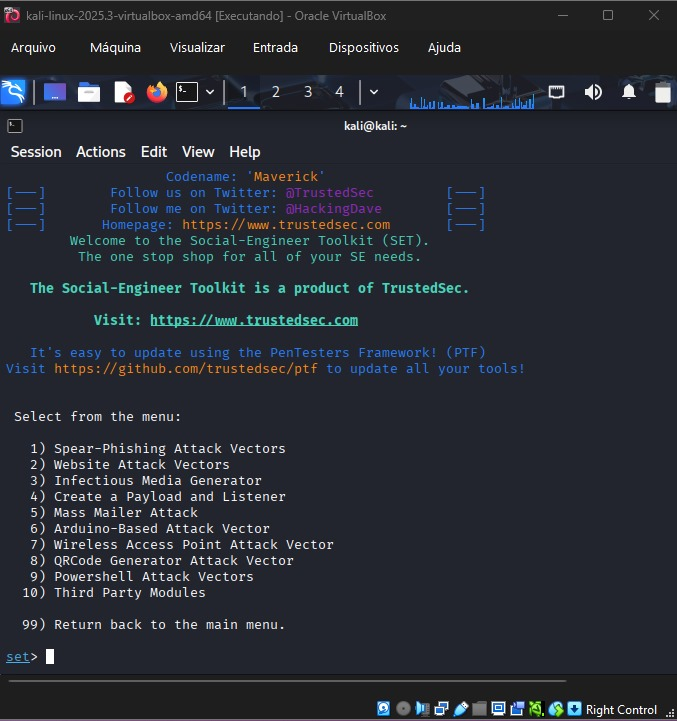
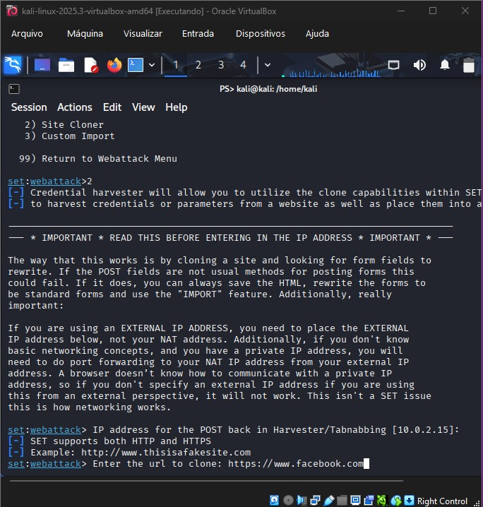
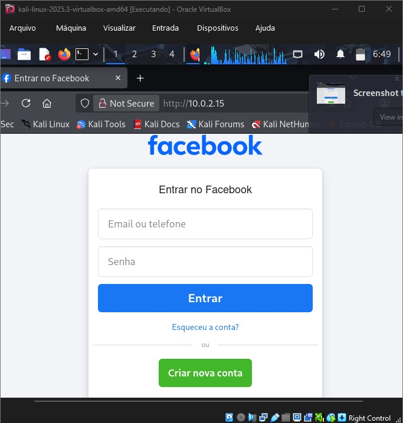
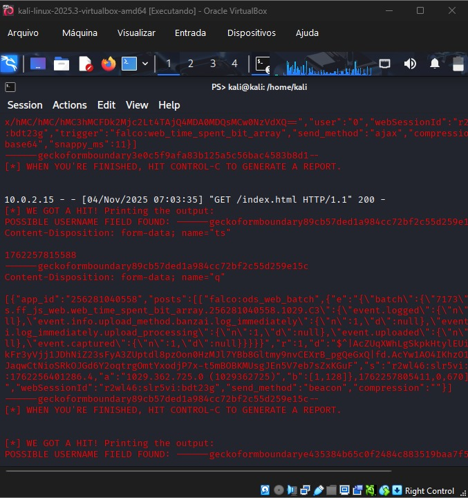
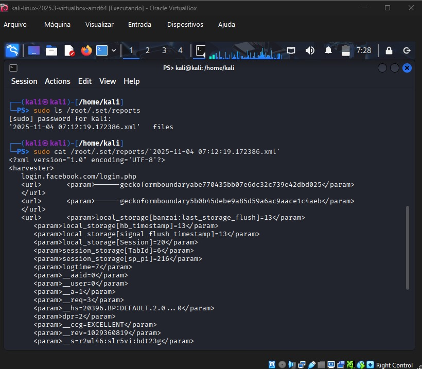

🚀 Simulação de Phishing com Kali Linux
Este projeto demonstra a criação e execução de um ataque simulado de phishing (simulação de engenharia social) utilizando o sistema operacional Kali Linux e a ferramenta Social-Engineer Toolkit (SET).
O objetivo é adquirir conhecimento sobre como funcionam os vetores de ataque de clonagem de sites e captura de credenciais.

🛠️ Ferramentas Utilizadas
* Sistema Operacional: Kali Linux (VM - Virtual Machine)
* Ferramenta Principal: Social-Engineer Toolkit (setoolkit)
* Alvo da Clonagem: Página de Login do Facebook

🔑 Passo a Passo da Execução e Provas (Relatório Fotográfico)
A execução seguiu a metodologia de ataque de Credential Harvester (Coletor de Credenciais) via clonagem de site.

### 1. Início do setoolkit e Escolha do Vetor
O desafio começou com a execução da ferramenta `sudo setoolkit` no Terminal. Esta tela confirma o carregamento do Social-Engineer Toolkit (SET). Em seguida, iniciamos a sequência de ataques:
1 - Social-Engineering Attacks
2 - Website Attack Vectors (Vetor de Ataque Web)

**Comprovação (Print):**

### 2. Configuração da Clonagem (O Coração do Ataque)
Nesta etapa, selecionamos o método de coleta e a forma de clonagem, garantindo que o alvo fosse o Facebook.
Selecionamos o `3 - Credential Harvester Attack Method` para garantir a captura de senhas.
Em seguida, selecionamos o `2 - Site Cloner` e confirmamos o endereço IP interno da VM (10.0.2.15) para o POSTback (recebimento dos dados).
A URL alvo foi inserida: `https://www.facebook.com`.

**Comprovação (Print):**

### 3. Servidor Ativo e Prova Visual (A Isca)
Após inserir a URL, o setoolkit clonou o site e iniciou o servidor web local. A mensagem confirma que o Credential Harvester está rodando na Porta 80.
Em seguida, a página clonada foi acessada no navegador, provando que a isca foi montada com sucesso.

**Comprovação (Prints):**
**Servidor Ativo:**

**Página Clonada (Isca):**

### 4. Prova Final: Captura e Extração de Credenciais
Ao simular um login na página falsa, o Terminal registrou o recebimento dos dados (WE GOT A HIT!). Para obter a prova limpa, foi necessário encerrar o servidor (Ctrl+C) e acessar o relatório salvo.
O relatório foi gerado e salvo em formato XML.
O comando `sudo cat` foi utilizado para ler o conteúdo do arquivo e encontrar as credenciais.

**Comprovação (Prints):**
**Acerto Registrado (HIT):**

**Acesso ao Relatório XML (Prova Final):**

✅ Conclusão
O projeto demonstrou o fluxo completo de um ataque de phishing baseado em engenharia social, confirmando o objetivo de conhecimento sobre o uso de ferramentas do Kali Linux e a extração bem-sucedida das credenciais de teste através do relatório XML.
